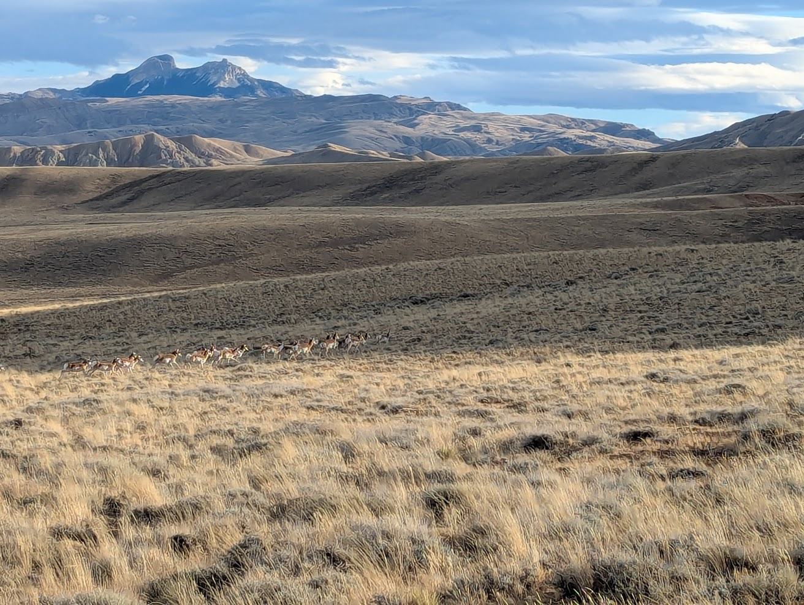

{fig-align="center"}

Welcome! I am Jacob Downs, an assistant professor in the computer science department at the University of Montana. Inspired by the beauty of the natural world, my research aims to improve out understanding of physical processes through numerical, statistical, and machine-learning based models.

This site hosts:

-   **Projects** (open-source + demos)
-   **Teaching materials** (course notes, labs)
-   **Writing** (short posts & guides)

::: callout-note
If you’re looking for my Cloud Computing course materials, see:\
[Cloud Computing Course Site](https://your-username.github.io/cloud-computing/)
:::
